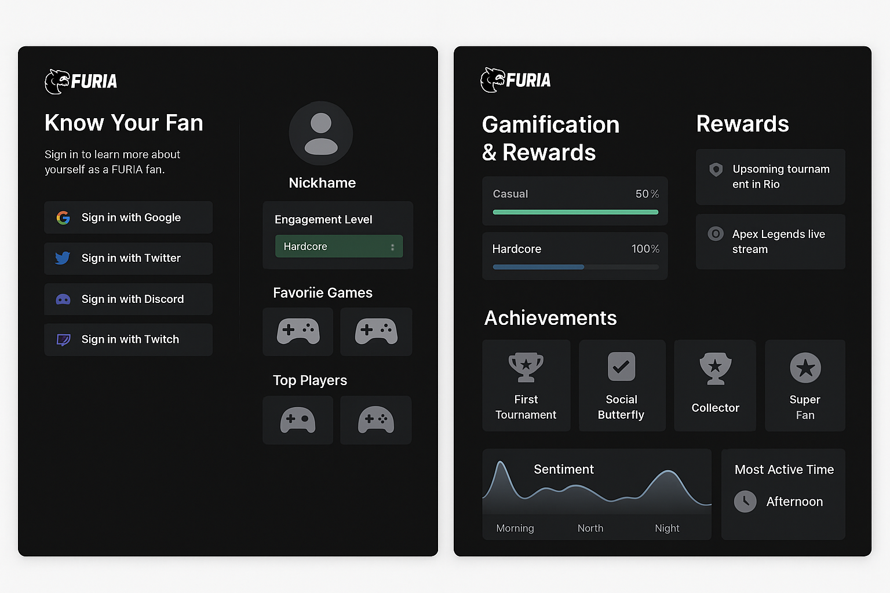

# 🐺 FURIA Fan Profile – Know Your Fan

Um app que conecta a comunidade FURIA de forma inteligente e divertida, usando dados de redes sociais e gamificação para criar uma experiência única para cada fã.

 

---

## 🔥 Sobre o Projeto

**Know Your Fan** é uma solução criada para entender melhor o fã da FURIA, oferecendo:

- Autenticação via redes sociais
- Perfil personalizado com preferências de jogos e jogadores
- Sistema de gamificação com conquistas e recompensas
- Recomendações baseadas em comportamento
- Análise de engajamento e sentimento via IA

---

## 🖥️ Tecnologias Utilizadas

**Frontend**
- React.js
- Tailwind CSS
- React Router

**Backend**
- Node.js + Express
- MongoDB (MongoDB Atlas)
- Passport.js (OAuth2 para Google, Twitter, Discord, Twitch)

**IA & Dados**
- OpenAI API (opcional)
- HuggingFace (NLP - análise de sentimento)
- Chart.js para gráficos

---

## 📸 Funcionalidades

- 🔐 Login com Google, Twitter, Discord e Twitch
- 📊 Dashboard com dados de engajamento
- 🏆 Sistema de conquistas (ex: "Super Fan", "Collector")
- 🎮 Jogos favoritos e jogadores mais seguidos
- 💡 Recomendações de eventos, lives e produtos
- 🧠 Análise de sentimento e comportamento (modo demo)

---

## 🚀 Como rodar o projeto localmente

### Clone o repositório

```bash
git clone https://github.com/rafaelholder/FURIA-Know-Your-Fan.git
cd furia-fan-profile
```
### Inicie o Frontend
```bash
cd client
npm install
npm run dev
```
### Inicie o Backend
```bash
cd ../server
npm install
npm run dev
```
### Configure variáveis de ambiente no .env com suas credenciais de APIs sociais e banco de dados.
